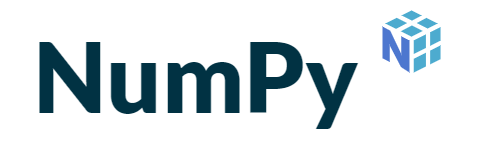

# Numpy

> Learning and practice Numpy package repository

> In this repository I've been collected some interesting notebooks that I've been practicing about Numpy package and can be an excellent and useful consultation source.

> Index:
* Installing NumPy
* How to import NumPy
* Creating an Array
* Adding, removing, and sorting elements
* How do you know the shape and size of an array?
	* Working with ndarray.ndim, ndarray.size, ndarray.shape
* Can you reshape an array?
  * Working with arr.reshape()
* Indexing and slicing an array
* Basic array operations
	* Addition, subtraction, multiplication, division, and more
	* maximum, minimum, sum, mean, product, standard deviation, and more
* Creating matrices
* Transposing and reshaping a matrix
	* Working with arr.reshape(), arr.transpose(), arr.T
* How to reverse an array
	* Working with np.flip()
* and more...
